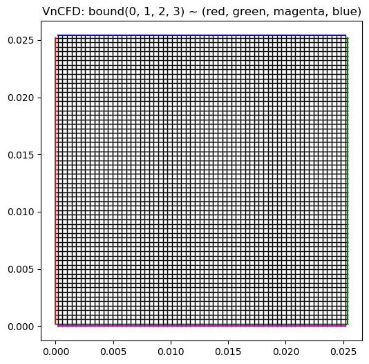
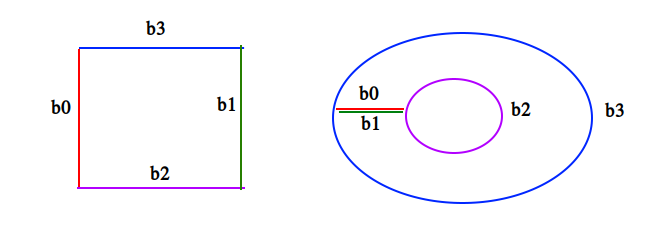
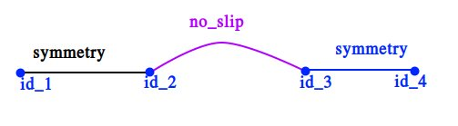
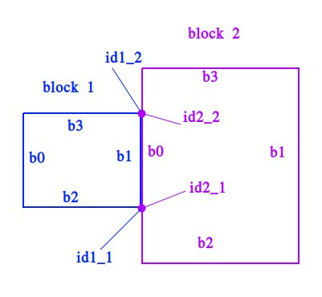
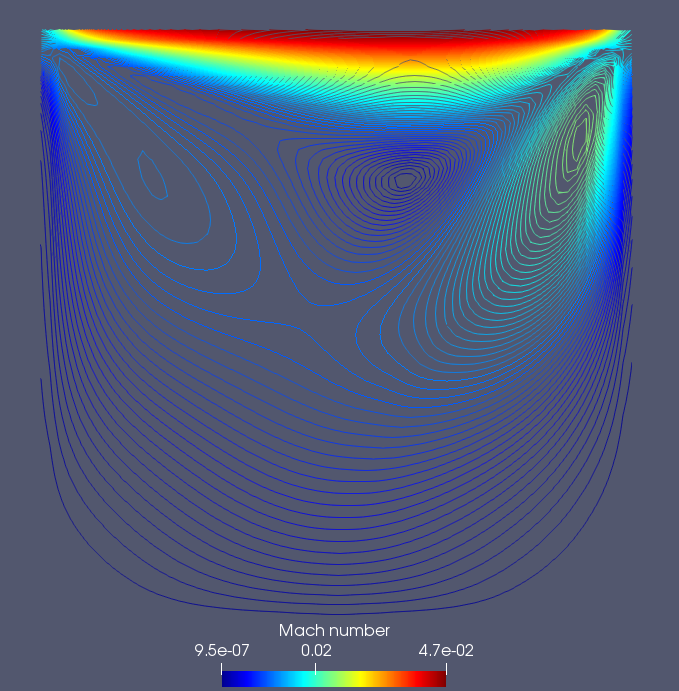
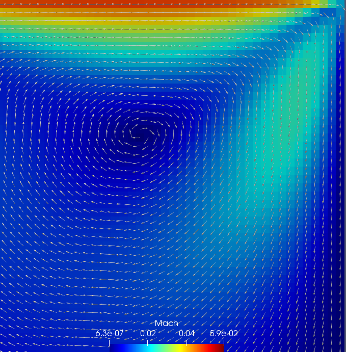
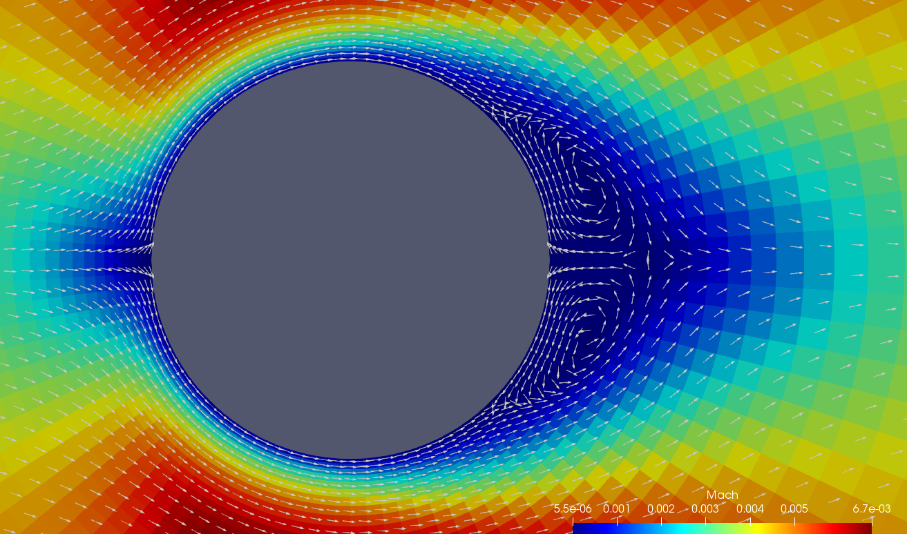

Copyright (C) 2021  Nguyen Ngoc Sang, <https://github.com/SangVn>

#  VnCFD_2.21.5 Tutorial

## Lid-driven Cavity Flow

CFD case based on https://www.grc.nasa.gov/WWW/wind/valid/cavity/cavity.html

## 1. Pre-processing

In "run_auto.py" directory, open file **setting.py**, make sure that two lines
    * from examples.lid_driven_cavity.project import *
    * path_dir = 'examples/lid_driven_cavity/'
are uncommented.

## 2. Mesh generation

The Cavity domain is a 1x1 inch square. A rectangular grid with 65x65 points will be used.
    
* Open **mesh_generator.py** module in **examples/mesh_generator** directory,
* Check parameters in the function *generate_mesh_cavity()*, 
* Make sure the first line in "__name__ == '__main__'" checking block is uncommented,
* Open Terminal (command-line) in this directory, type then press Enter: **python mesh_generator.py**
* In "run_auto.py" directory, open terminal and check mesh by command: **python run_auto.py plot_mesh**
* Remember the index of the bounds to set boundary conditions after

**Note:** 
Make sure that the positions of the bounds like:

Also, you can use **Paraview** to show the mesh:
    * run "Paraview", click "Open..."
    * select "examples/lid_driven_cavity/mesh.dat" file, press "Ok"
    * in "Open Data With..." window, make sure "Tecplot Reader" is selected, then press "Ok"
    * click "Apply" button on the left
    * choose "Wireframe" in "Representation" of "Display" to view the mesh

(Read section "2.1.2 Viewing the mesh" in this tutorial [openfoam_cavity](https://www.openfoam.com/documentation/tutorial-guide/tutorialse2.php#x6-60002.1) for more iformation)

**Note:** 
VnCFD_2.21.5 uses only structured mesh. If you have a CGNS mesh:
    * open it with paraview, press "Apply",
    * click "Information" to know mesh size (dimension)
    * (if it's 3D mesh, make a "Slice" to get 2D mesh),
    * select "File" -> "Save Data" -> type "File name" (e.g. "mesh.txt") -> Enter 
    * to convert it to VnCFD_2.21.5 mesh format, modify and run "convert_cgns_mesh_1()" function in module "convert_mesh.py".

## 3.  Initial, boudary conditions and control

All calculation settings are in **project.py** module in "examples/lid_driven_cavity" directory.

### 3.1 Initial conditions

There are 2 principal entries must be set:

**The freestream field:** 
        * P_freestream = [rho (density), u (velocity_X), v (velocity_Y), p (pressure)]
    
**The initial internal field:** 
        * P_init_field = [rho, u, v, p]
    
In this case, we use *P_US2SI fuction* from "service.py" module to convert US Customary to SI units:
        * P_freestream = P_US2SI(M=0.05, T_rankine=460.0, p_psi=0.0425, alf=0.0)
    
Set the same density, temperature, pressure for internal field except the velocity field is zero:
        * P_init_field = [P_freestream[0], 0.0, 0.0, P_freestream[3]]
    
In many other cases we can set:
        * P_init_field = P_freestream
 
### 3.2 Boundary conditions 

The boundary condition is *moving_wall* for the top of the cavity. So we need to set boundary field. In this case velocity of the top wall is freestream velocity:
        * U_wall = [[P_freestream[1], P_freestream[2]]

The boundary condition for the fixed sides and base of the cavity is *no_slip*. We use function "set_boco()" to set all these conditions:
<b>
    
    def set_boco():
        set_boco_const(P_freestream, U_wall=U_wall)
        bc_0 = [(no_slip, None, None)]
        bc_1 = [(no_slip, None, None)]
        bc_2 = [(no_slip, None, None)]
        bc_3 = [(moving_wall, None, None)]
        blk1_bc_list = [bc_0, bc_1, bc_2, bc_3]

        boco_list = [blk1_bc_list]
        joint_list = None
        return boco_list, joint_list

    boco_list, joint_list = set_boco() 
</b>

First thing is setting boundary condition constants: 
        * set_boco_const(P_freestream, U_wall=U_wall)
        
Then, set boundary condition for each bound 
        * boco = [(boco_name, start_index, end_index), (...)]
        
For example: 
        * boco = [(symmetry, id1, id2), (no_slip, id2, id3), (symmetry, id3, id4)]

where **start_index, end_index** -- index of start and end cell-face on the bound. They can be *None* - it means "from the first to the last cell-face". In our *cavity* case, there is **only one condition on one bound**, so we have:
    
        bc_0 = [(no_slip, None, None)]
        bc_1 = [(no_slip, None, None)]
        bc_2 = [(no_slip, None, None)]
        bc_3 = [(moving_wall, None, None)]
        
Then we collect them into one list: 

        blk1_bc_list = [bc_0, bc_1, bc_2, bc_3]
        
The mesh may contain more than one block, for each block need to set boundary contions and then collect them in one list. For exmaple:        
        
        boco_list = [blk1_bc_list, blk2_bc_list]

For this case *cavity* there is only one block, so *boco_list = [blk1_bc_list]*. 

When blocks are connected or boundary conditions is *joint* (periodic) we need to set **joint_list**:
    * joint_list = [(first_block_id, bound_id, sub-bound_id, second_block_id, bound_id, sub-bound_id),(...)]
For above example, we have:
    * joint_list = [(0, 1, 0, 1, 0, 2)]
For *cavity* case, there are no *joint* boundary condtions, so *joint_list = None*.

### 3.3 Control

The solver, scheme, the control of time, interation, printing, writting of the solution data are set below:

<b>
    
    # solver = "eu"            # (Solver: Euler or Navier-Stokes)
    solver = "ns"
    # reconstr = "godunov"     # (Scheme: first-order Godunov or second-order TVD)
    #reconstr = "tvd_vector"   # (TVD scheme: vector or component reconstruction)
    reconstr = "tvd_component"

    CFL = 0.5                  # (CFL number)
    time_target = None         # (Time to stop the calculation)
    iter_target = 5000         # (Number of steps to stop the calculation)
    misclosure_target = None   # (Convergence level to stop the calculation, e.g. -9 (~1e-9))

    write_field_frequency_time = None  # (time frequency to write field)
    write_field_frequency_iter = 1000  # (step frequency to write field)

    print_frequency_iter = 100         # (show time-step, convergence, ...)
    export_field_frequency_iter = None # (step frequency to export data, only for serial run)    
</b>

### 4. Run 

In "run_auto.py" directory, open Terminal (Command-line, PowerShell). Execute the folowing commands:
0. View run_auto.py help 
        * python run_auto.py help
        
1. Set initial field 
        * python run_auto.py init
        
2. Run the calculation 
        * python run_auto.py run
        
3. Export the data, when the calculation ends 
        * python run_auto.py export

To use MPI, run *run_auto.py* by one of these commands:
        * mpiexec -n N python run_auto.py ...
        * mpirun -n N python run_auto.py ...
Here N - the number of processes to run.

**Note 1**: 
In VnCFD_2.21.5 version, MPI works correctly only when the blocks are in the queue: 
         * | block 0 | block 1 | block 2 | ... |
not that: 
         * | block 0 | block 1 |
         * |---------|---------|
         * | block 2 | block 3 |
            
**Note 2**: 
If you want to run the calculation with more time or step-number, change these values in "project.py" and run it again **without "set initial field"**.

### 5. Post-porcessing

To plot field or convergency, run commands: 
        * python run_auto.py plot_field p (u, v, rho)
        * python run_auto.py plot_state

For mor flexibility, use **Paraview** to view file "examples/lid_driven_cavity/field.dat":
        * run "Paraview", click on "File", select "Load State..."
        * double click on "examples/lid_driven_cavity/paraview.pvsm"
        * in "Load State Options" window, click on "Use File Names From State"
        * click "Choose File Names", find where the "field.dat" file is located
        * double click on it, then click "Ok" and it's done!
    

The Mach number contours: 

The plot of the velocity vectors colored by the Mach number near the upper right corner: 

(Read section "2.1.4 Post-processing" in this tutorial  [openforam_cavity](https://www.openfoam.com/documentation/tutorial-guide/tutorialse2.php#x6-60002.1) for more information). 

**For more example see in the "examples" directory!** 

 Flow over cylinder, Re = 40

## Thank you for your attention!
